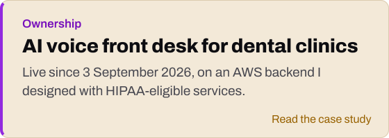
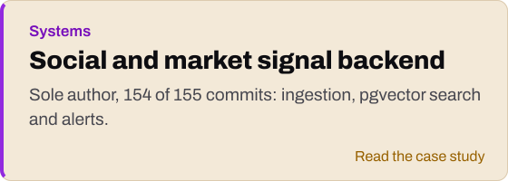
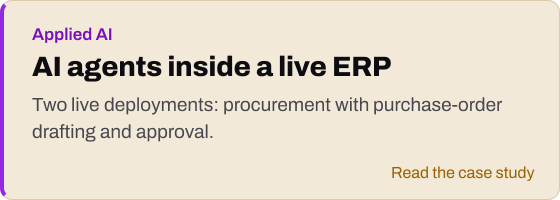
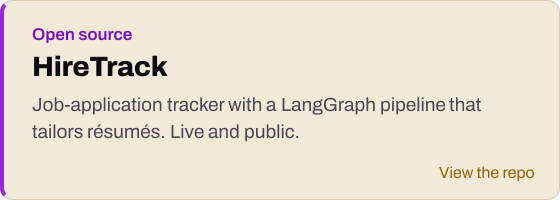

<a href="https://mubashirrehman.com">
  <picture>
    <source media="(prefers-color-scheme: dark)" srcset="assets/banner-dark.svg">
    
  </picture>
</a>

I build the backend systems behind messy, multi-system workflows, then stay to keep them running. I lead five engineers at TransData, and my favourite bug is a number that does not add up.

Most of my work is under NDA in private repositories, so my [portfolio](https://mubashirrehman.com) describes it by function, with a system diagram and what broke for each.

<a href="https://mubashirrehman.com/projects/dental-ai-front-desk/"><picture><source media="(prefers-color-scheme: dark)" srcset="assets/card-dental-dark.svg"></picture></a>
<a href="https://mubashirrehman.com/projects/social-signal-intelligence-backend/"><picture><source media="(prefers-color-scheme: dark)" srcset="assets/card-signal-dark.svg"></picture></a>
<a href="https://mubashirrehman.com/projects/erp-ai-agents/"><picture><source media="(prefers-color-scheme: dark)" srcset="assets/card-erp-dark.svg"></picture></a>
<a href="https://github.com/mubashir-rehman/job-application-tracker"><picture><source media="(prefers-color-scheme: dark)" srcset="assets/card-hiretrack-dark.svg"></picture></a>

#### Research

Co-author, *Evaluation of a low-cost single-lead ECG module for vascular ageing prediction and studying smoking-induced changes in ECG*, Circuits, Systems, and Signal Processing (Springer, 2025). I owned the data and model-training pipeline. [DOI](https://doi.org/10.1007/s00034-025-03048-2) · [arXiv](https://arxiv.org/abs/2308.04355)

#### Daily tools

<picture>
  <source media="(prefers-color-scheme: dark)" srcset="assets/stack-dark.svg">
  
</picture>

#### Say hello

[Email](mailto:hello@mubashirrehman.com) · [LinkedIn](https://www.linkedin.com/in/mubashir-rehman) · [Google Scholar](https://scholar.google.com/citations?user=-N7lsKsAAAAJ) · [Portfolio](https://mubashirrehman.com)

Let the beauty of what you love be what you do.
